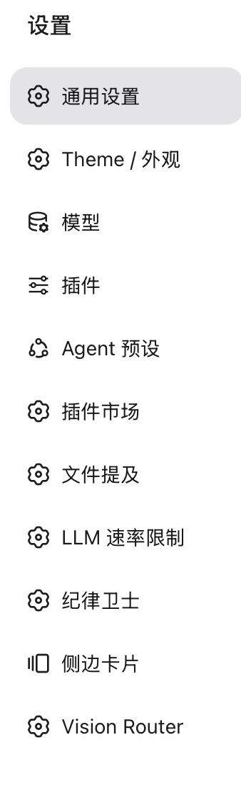
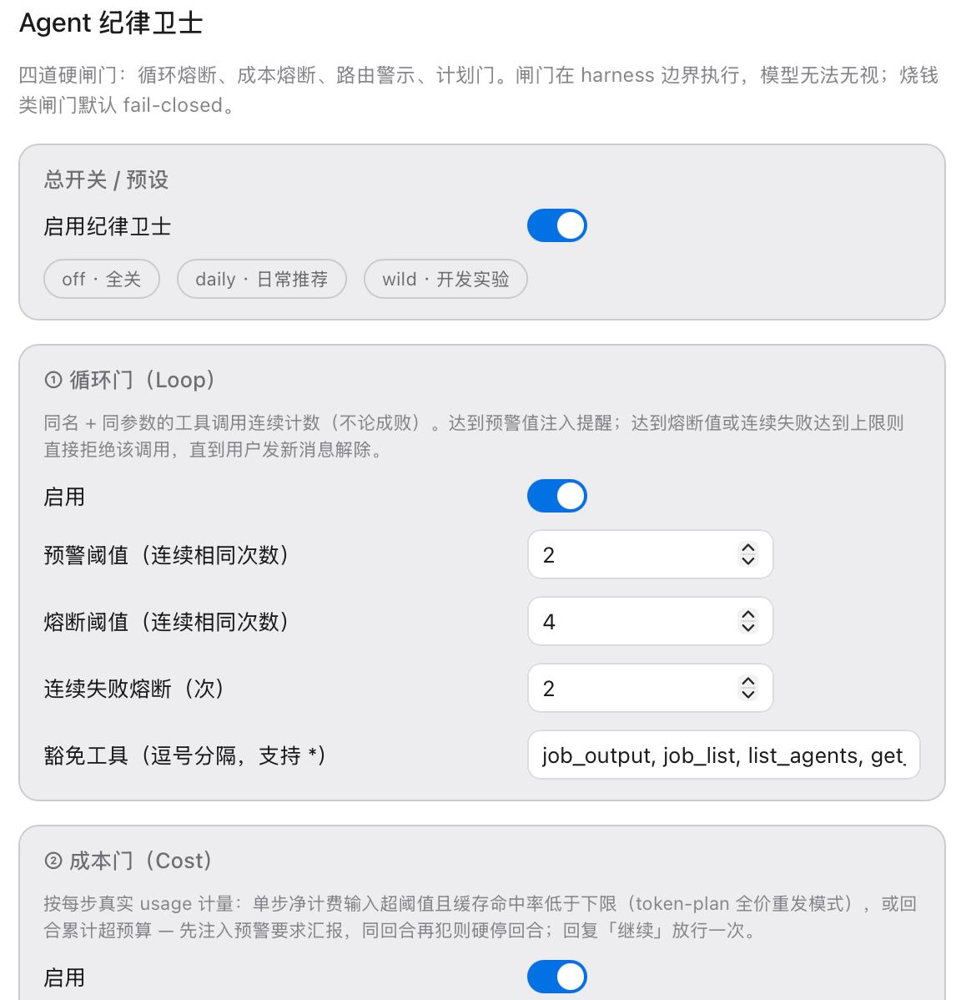

# dsh-discipline-guard · Agent Discipline Guard

**Your agent burned through a weekly token quota in 3 minutes — while politely telling you it was "almost done". This plugin stops it at the harness boundary, where text-based reminders can't reach.**

<table>
  <tr>
    <td align="center"><br><em>🛡 one-click chip in the session header</em></td>
    <td align="center"><br><em>Settings → Discipline Guard</em></td>
    <td align="center"><br><em>Per-gate switches, thresholds & presets (off / daily / wild)</em></td>
  </tr>
</table>

Prompt-level "please don't repeat yourself" reminders are advisory: a determined (or confused) model walks straight through them. `dsh-discipline-guard` is not a prompt. It hooks the harness waterfall (`tools/pre-execute`, `agent/pre-step`, `session/event`) and **refuses dispatches, blocks turns, and pops native approval cards** — the model cannot argue with the tool pipeline never running.

## The four gates

| # | Gate | Default | What it does |
|---|------|---------|--------------|
| ① | **Loop breaker** | on | Counts identical tool+arguments calls per agent. 2nd repetition → visible warning injected; 4th → the call is **denied before dispatch** (2 consecutive failures trips it even faster). Any new user message releases it. |
| ② | **Cost fuse** | on, fail-closed | Meters every step from **real usage data** (input tokens net of cache, cache-hit rate, per-turn cumulative). Typical token-plan pattern — huge full-price resend with ~0% cache hits — gets a warning first; a repeat violation in the same turn **hard-stops the turn**. Reply `继续/放行/别停/照常` (or `continue`) to release one turn. |
| ③ | **Route watcher** | on | When the session switches model endpoints with a long history, injects a one-time warning: the new endpoint may re-bill your whole context at full price. |
| ④ | **Plan gate** | off | Opt-in: the first write/execute tool call of each user turn routes through the native approval card. One approval covers the turn. |

Every gate is individually switchable with its own thresholds, and every listener is **fail-open internally**: a bug in the guard can never brick the harness it protects. Money-class gates are fail-**closed** by design: they stop and wait for you.

## Control surfaces

- **Main UI**: a 🛡 chip in the session header — one click arms/disarms everything (the escape hatch must never be buried).
- **Settings → Discipline Guard（纪律卫士）**: per-gate switches, thresholds, and three presets:
  - `off` — everything disabled
  - `daily` (default) — tuned for cached routes (deepseek-style: 1–5K net input/step will never trip it) while capping an uncached runaway at ~500K tokens/turn instead of millions
  - `wild` — warns but never interrupts; for experimental heavy work
- **Settings namespace** `discipline-guard` in `~/.dsh/settings.yaml`, hot-reloaded — no restart needed after the first install.

## Typical release flow (the guard never decides for you)

```
gate trips  →  you look  →  worth it?  →  reply 「继续」  →  the rest of the turn runs free
                                         not worth it? →  you stopped a fire in one turn
```

One nuance on purpose: replying anything resets the loop breaker; the release words only waive the **current turn**. The next turn starts a fresh ledger — the guard never accumulates grudges, and never quietly forgets.

## Install

Requires DSH with the web profile (client UI is web-only for now; the host gates work everywhere).

### A. Via plugin market (once listed)

Open DSH → Plugins market → search "discipline guard" → install.

### B. Manual install

Add the plugin to your profile (`~/.dsh/profiles/<profile>/package.json`):

```jsonc
{
  "dependencies": {
    "dsh-discipline-guard": "github:haozheou/dsh-discipline-guard"
  },
  "dsh": {
    "profile": {
      "bundles": [
        // ... your existing bundles ...
        "dsh-discipline-guard"   // ← add this line
      ]
    }
  }
}
```

Then `pnpm install` in the profile directory and restart DSH. The bundle's own `cordis.patch.yml` mounts the plugin row automatically.

## Thresholds: how to tune

Measured baselines (per step, net-billable input):

- cached route (deepseek-style): 1–5K tokens, ~97% cache hits → daily defaults never fire
- uncached "token plan" route: the entire context re-billed every step → that is what ② exists to cap

| If your workload… | adjust |
|---|---|
| gets stopped while doing legitimate long work | raise `costTurnBudget` (500K → 800K+) |
| runs on a route where caching is broken | that is exactly the pattern ② exists to cap — check the context size, not the thresholds |
| polls tools on purpose (job waiting etc.) | add them to `loopExclude` |

The incident replay test: 16 steps × 360K full-price resend = 5.74M tokens in 3 minutes → with daily defaults, execution stops at ~550K (≈90% saved), mid-run, with a visible reason.

## Known limitations

- Client UI (chip + settings page) targets the **web** profile; desktop profile gets host gates only (config via `settings.yaml` directly).
- Cost metering is per-turn/per-session; parallel sub-agents' usage is metered per agent, session aggregate in v2.
- Coexists with the built-in `repeat-tool-reminder` (advisory at 3/5/8 repetitions). If the double notices annoy you, disable the built-in one.

## Credits

- Loop-chain canonicalization pattern borrowed (in spirit) from DSH's built-in `repeat-tool-reminder`.
- Built on Cordis / DeepSeek Harness plugin APIs: `tools/pre-execute`, `tools/post-execute`, `agent/pre-step`, `session/event`, `approval`, `dsh-settings`.

MIT © haozheou

---

中文文档见 [README.zh.md](./README.zh.md)。
